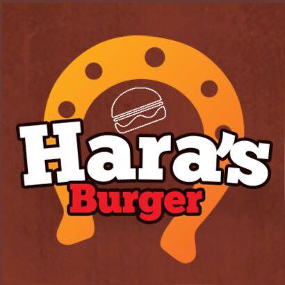
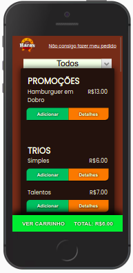
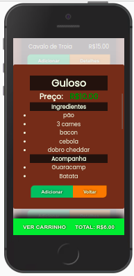
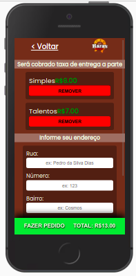
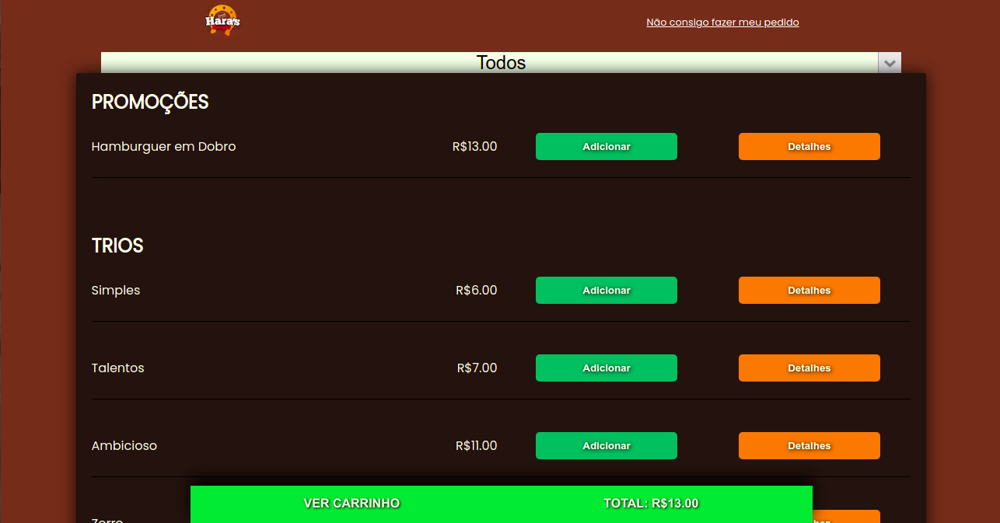
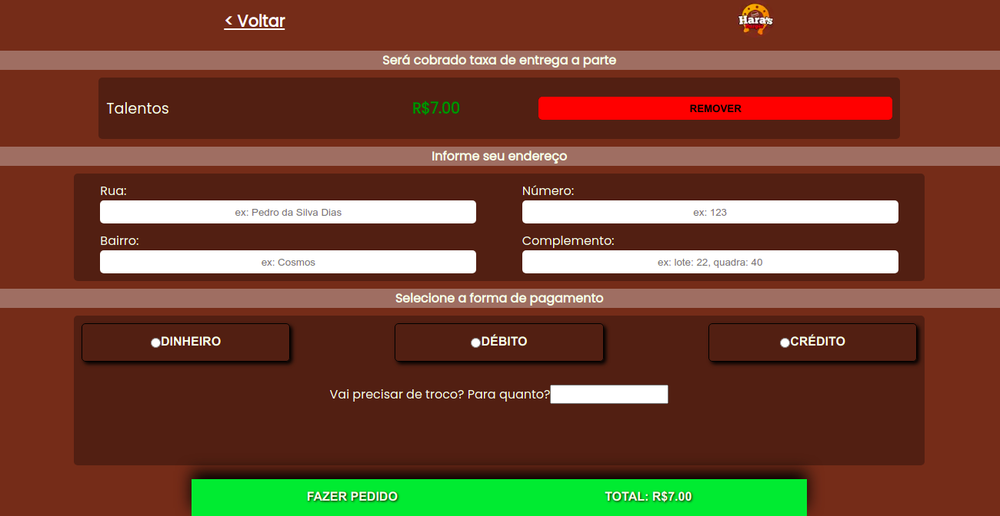

# Haras Burger

Hara's Burger é uma lanchonete da zona oeste do RJ capital, com foco em delivery de hamburgers, mas com loja física e com um cardápio com variedades. 

## O projeto

O projeto é uma aplicação web responsiva, o objeto da aplicação é dar ao usuário uma boa experiência com usabilidade fácil e permitir conversas rápidas pelo whatsapp, com um pedido bem detalhado contendo endereço, forma de pagamento, pedido e valor, assim permitindo o/a atendente responder todos clientes de forma rápida, sem que o/a cliente precise esperar muito tempo para ser respondido(a).

### Imagens

#### Mobile

#### Desktop

## Tecnologias utilizadas

* Nextjs
* Styled Components
* React Hooks
* Context API
* Type Script

### Acesso a aplicação
##### Atenção
> Por favor não enviar pedidos, Hara's Burger é uma lanchonete real.

https://haras-burger.vercel.app/
